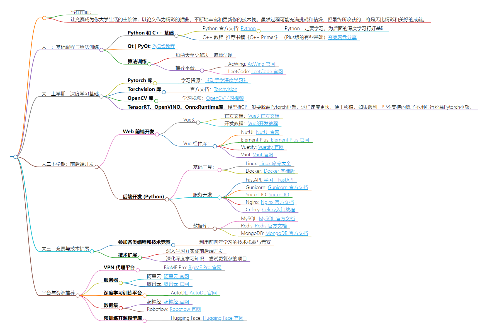

>   写在前面：
>
>   让竞赛成为你大学生活的主旋律，以论文作为精彩的插曲，不断地丰富和更新你的技术栈。虽然过程可能充满挑战和枯燥，但最终所收获的，将是无比精彩和美好的成就。

### 大一：基础编程与算法训练

- **Python 和 C++ 基础**

    - Python 官方文档: [Python](https://docs.python.org/3/) 

        >   Python一定要学习，为后面的深度学习打好基础

    - C++ 教程: 推荐书籍《C++ Primer》 （Plus版的有些基础）[夸克网盘分享](https://pan.quark.cn/s/1a9050349a64#/list/share)

- **Qt | PyQt**: [PyQt5教程](https://blog.csdn.net/m0_57021623/article/details/123459038)

- **算法训练**

    - 每两天至少解决一道算法题
    - 推荐平台：
        - AcWing: [AcWing 官网](https://www.acwing.com/)
        - LeetCode: [LeetCode 官网](https://leetcode.cn/)

### 大二上学期：深度学习基础

- **Pytorch 库**
    - 学习资源：[《动手学深度学习》](https://zh-v2.d2l.ai/)
- **Torchvision 库**
    - 官方文档：[Torchvision](https://pytorch.org/vision/stable/index.html)
- **OpenCV 库**
    - 学习视频：[OpenCV学习视频](https://www.bilibili.com/video/BV1i54y1m7tw/)
- **TensorRT、OpenVINO、OnnxRuntime库**，模型推理一般要脱离Pytorch框架，这样速度更快，便于移植，如果遇到一些不支持的算子不用强行脱离Pytorch框架。

### 大二下学期：前后端开发

- **Web 前端开发**
    - Vue3:
        - 官方文档：[Vue3 官方文档](https://cn.vuejs.org/examples)
        - 开发教程：[Vue3开发教程](https://blog.csdn.net/weixin_39873136/article/details/123418796)
    - Vue 组件库：
        - NutUI: [NutUI 官网](https://nutui.jd.com/#/)
        - Element Plus: [Element Plus 官网](https://element-plus.org/#/zh-CN)
        - Vuetify: [Vuetify 官网](https://vuetifyjs.com/en/)
        - Vant: [Vant 官网](https://youzan.github.io/vant/#/zh-CN)
- **后端开发 (Python)**
    - 基础工具：
        - Linux: [Linux 命令大全](https://www.linuxcool.com/)
        - Docker: [Docker 基础版](https://zhuanlan.zhihu.com/p/442442997)
    - 服务开发：
        - FastAPI: [学习 - FastAPI](https://fastapi.tiangolo.com/zh/learn/)
        - Gunicorn: [Gunicorn 官方文档](https://gunicorn.org/)
        - Socket.IO: [Socket.IO](https://socket.io/zh-CN/docs/v4/)
        - Nginx: [Nginx 官方文档](https://www.w3ccoo.com/nginx/)
        - Celery: [Celery入门教程](https://blog.csdn.net/youzhouliu/article/details/124239709)
    - 数据库：
        - MySQL: [MySQL 官方文档](https://dev.mysql.com/doc/)
        - Redis: [Redis 官方文档](https://redis.io/documentation)
        - MongoDB: [MongoDB 官方文档](https://docs.mongodb.com/)

### 大三：竞赛与技术扩展

- **参加各类编程和技术竞赛**
    - 利用前两年学习的技术栈参与竞赛
- **技术扩展**
    - 深入学习并实践前后端开发
    - 深化深度学习知识，尝试更复杂的项目

### 平台与资源推荐

- **VPN 代理平台**
    - BigME.Pro: [BigME.Pro 官网](https://www.bigme.pro/)
- **服务器**
    - 阿里云: [阿里云 官网](https://www.aliyun.com/)
    - 腾讯云: [腾讯云 官网](https://cloud.tencent.com/)
- **深度学习训练平台**
    - AutoDL: [AutoDL 官网](https://www.autodl.com/)
- **数据集**
    - 超神经: [超神经 官网](https://www.chaoshenjing.com/)
    - Roboflow: [Roboflow 官网](https://roboflow.com/)
- **预训练开源模型库**
    - Hugging Face: [Hugging Face 官网](https://huggingface.co)

